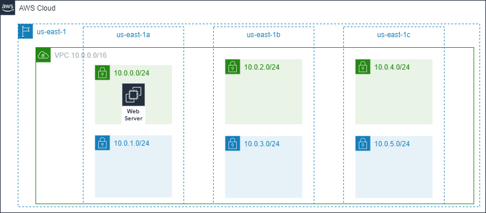
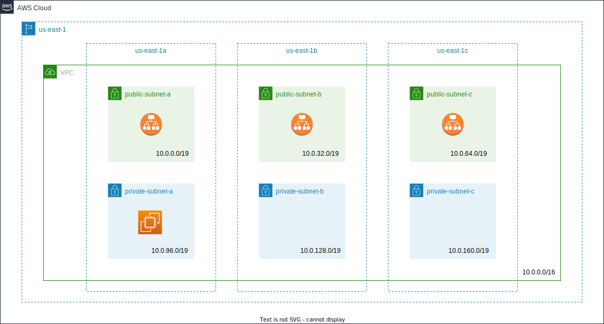

# cpe-tp

Repository containing practical work for Lyon CPE AWS classes.

## Introduction

For all modules below, here are the first steps:
1) Start the sandbox environment (and not a Lab environment) in AWS Academy.
2) Create an AWS Cloud9 environment from the AWS Console with a `t3.small` instance type.
3) In network settings, you must select "Secure Shell (SSH)", else it won't work.
4) Still in the network settings, go into "VPC settings" and update the subnet to target `us-east-1a`.
5) Once in the Cloud9 environment, you can checkout the code:
```bash
git clone https://github.com/ippontech/cpe-tp.git
```

## Module 1 - AWS Cloud Concepts

1) After you have cloned the git repository, you can go into the module:
```bash
cd cpe-tp/01_cloud_concepts/
```
2) And start working with Terraform:
```bash
# Init the Terraform layer and download required providers
terraform init
```
3) Open the file `random.tf`. You need to create a random integer resource in that file between 10 and 20.
4) When the resource is ready in your code, try `terraform plan` to see what Terraform will do. If you're satisfied with
the plan, you can then `terraform apply`.
5) You now need to create an output to store the result of your random integer to see its value. Look into the Terraform
documentation on how to create an output.
6) It's now time to create your first Terraform variables. You need to create 2, one variable called `min` and one
called `max`. Give those variables the values you had before and use them in your random integer resource.
7) (optional) Now, if you have time, go into the AWS console and take a look at the AWS S3 service. Create a test
S3 bucket in the console and try to update a file from your computer into the bucket.
8) (optional) Now, try to create an S3 bucket with some Terraform code with the mechanics you've learnt:
   1) You'll have to add the AWS provider in the Terraform configuration files and rerun a `terraform init` command to
   download the provider.
   2) Then try to create a S3 bucket with come code with Terraform documentation.

## Module 4 - AWS Cloud Security

1) After you have cloned the git repository, you can go into the module:
```bash
cd cpe-tp/04_cloud_security/
```
2) And start working with Terraform:
```bash
# Init the Terraform layer and download required providers
terraform init

# Take a look at what Terraform will do on AWS
terraform plan

# Create/update resources on AWS
terraform apply
```
3) Go look into the AWS Console that an SNS topic was created after you ran `terraform apply`.
4) Try to update the "Display name" through the AWS console and re-run `terraform apply` afterwards and see what
happens.
5) Check that you can send a message into the topic with the "Publish message" button in the console.
6) Take a look in the AWS console at the generated SNS policy in the "Access policy" tab. This policy
was auto-generated and does not respect least privilege at the moment.
7) Now, you need to add an SNS policy on that topic with some Terraform code in `sns.tf` file to block the
IAM role `voclabs` from publishing any SNS message in the topic. The `voclabs` IAM role is the role you
are assuming when you are using the AWS Console.
8) Once the policy has been modified with Terraform. Check that you cannot publish anymore an event in the topic
through the AWS console.
9) Once you have succeeded the previous steps, authorize the `voclabs` role to publish messages but block
every other IAM user/role from doing so (always with Terraform). Check that you can now publish again a message
into the topic.
10) (optional) Create a Terraform module to create a SNS topic with an IAM policy. Refactor the code you've written
to create your SNS topic with your module.
11) (optional) Now, try to create a 2nd SNS topic with your module.

### Go further

Terraform offers other useful commands such as:
* `terraform state` to look into the state of your infrastructure (to read it or to update it for instance).
* `terraform import` to include an already existing resource into the state.
* `terraform destroy` to destroy the infrastructure you created.
* ...

Check out the Terraform documentation and try out a few of these commands to get used to using Terraform.

In this Terraform code example, we are using a Terraform local backend, which is not a good practice for
production. When working with AWS, it's strongly recommended to use
the [S3 backend](https://www.terraform.io/language/settings/backends/s3). Try to set it up in place of the local
backend.

## Module 5 - Networking

In this module we will deploy the following infrastructure:



1) After you have cloned the git repository, you can go into the module:

```bash
cd cpe-tp/05_networking/
```

2) And start working with Terraform:

```bash
terraform init
terraform plan
terraform apply
```

3) Go look into the AWS Console for the new resources that have just been created:

* a VPC named `05_networking-vpc` with CIDR block `10.0.0.0/16`
* an internet gateway `05_networking-internet-gateway`
* 2 route tables: one public and one private

Check the public route table: there should be one route towards the internet gateway. That route will help us later
to make public subnets.

4) Now, it's your turn to work! You will have to first create 2 subnets within the newly created VPC:

* 1 public subnet with CIDR `10.0.0.0/24`
* 1 private subnet with CIDR `10.0.1.0/24`

Both subnets should be created in the Availability zone A. Beware, public subnets should have `map_public_ip_on_launch`
parameter set to `true` so that instances started in these subnets get a public IP. You can check `aws_subnet`
resource in [Terraform documentation](https://registry.terraform.io/providers/hashicorp/aws/latest/docs/resources/subnet).

5) Once the subnets are created, you will have to associate them to the Route tables to allow internet access.
If not, when you start an instance, you won't be able to access internet resources.
Use `aws_route_table_association` resources to associate the public subnet to the public route table and the private
subnet to the private route table.

6) Now we have 2 subnets, in the AZ a: one public and one private. But it's not highly available at the moment. If the AZ a
fails, our applications deployed in those subnets would not be able to recover. Let's now create 4 new
subnets:

* 2 new public subnets in AZ b and AZ c
* 2 new private subnets in AZ b and AZ c as well

Each of these subnets should have 256 IP addresses each (`/24`), and none of them should overlap.

> Note: a `/24` contains 256 IP addresses. You can use this [IP address site](https://www.ipaddressguide.com/cidr)
to help you set up your subnet's CIDR blocks. Otherwise, you can use the unix utility `ipcalc`.

7) (optional) Start an EC2 instance manually inside the AWS Console assigned to one of your public subnets.
Try to connect through SSH to this instance and verify that you can access the internet with the help of the curl program.
You can check that `curl http://ifconfig.io` returns the public IP address of your EC2 instance.

## Module 6 - Compute

> All resources in this lab should be created with Terraform!

1) After you have cloned the git repository, you can go into the module:
```bash
cd cpe-tp/06_compute/
```

2) And start working with Terraform to initialize the VPC resources (VPC / subnets / internet gateway / Route tables / NAT...):
```bash
terraform init
terraform apply
```

3) Go look into the AWS Console for the new resources that have just been created:
* a VPC named `06-compute-vpc` with CIDR block `10.0.0.0/16`;
* 6 subnets: 3 public and 3 private in 3 different AZ;
* an internet gateway `06-compute-internet-gateway`;
* 2 route tables, one public and one private:
  * the public one contains a route towards the internet gateway to access the internet;
  * the private one contains a route towards the NAT gateway.

4) Take a look at the `modules/compute/0-ec2.tf` file. It currently contains 2 datasources which are already existing resources on the
AWS account you are using:
* an `aws_ami` datasource named `amazon_linux_2_ami` which we will use as a base machine image to start an EC2 instance.
This AMI will retrieve the most recent Amazon Linux 2 AMI provided by Amazon with a 64 bits architecture and it will
use a GP2 SSD as a hard drive.
* an `aws_iam_instance_profile` datasource named `ssm_instance_profile` which we will use to provide IAM rights to the
EC2 instance you will create afterwards. This instance profile is provided by Amazon lab and contains, among others,
some IAM rights so that you can access a terminal on your EC2 instance thanks an AWS service called AWS Systems Manager.

5) Now, you must create an EC2 instance with an `instance_type` of `t3.small` in one of the public subnets provided
for you in the code. **You will need to use [Variables and Outputs](https://developer.hashicorp.com/terraform/language/values)
to get public subnets IDs created by the *network* module and use them in the *compute* module**. This EC2 instance will be
called `bastion`. We will use it for SSH access to your AWS resources.
This instance will need to use the provided AMI (`amazon_linux_2_ami`) in the code as well as the IAM instance profile
also provided (`ssm_instance_profile`). To create an EC2 instance through Terraform, you can use `aws_instance` resource.
Take a look at the [Terraform documentation](https://registry.terraform.io/providers/hashicorp/aws/latest/docs/resources/instance).

6) When the instance has been created, you should be able to access it through AWS Systems Manager in the AWS UI.
Go to the [EC2 AWS console](https://us-east-1.console.aws.amazon.com/ec2/v2/home?region=us-east-1#Instances:), right
click on the instance and choose "Connect". This will bring you to a new "Connect to instance" page, here choose
"Session Manager" and then click on "Connect". This will bring you to a browser shell terminal. Check that
`curl http://ifconfig.io` returns the public IP address of your EC2 instance. You can then disconnect from the EC2
 instance with your browser.

7) Create an SSH key pair on the Cloud9 instance (and not the bastion instance previously accessed through AWS System
 Manager) by using the following command:
```bash
ssh-keygen -f bastion_cpe_key 
```
When asked to enter a passphrase, leave it empty.

8) Now that you have an SSH key pair, you can import the public key into AWS with `aws_key_pair` resource. You will have
to fill in a `key_name` and the `public_key` with the content of the file `bastion_cpe_key.pub` created in step 7.

9) Now that you have created the `aws_key_pair`, you must associate it to your `aws_instance` with the argument
`key_name`.

10) In `modules/compute/0-ec2.tf`, there is an already existing `aws_security_group` allowing all outgoing traffic.
You must edit that security group to allow SSH access on tcp port 22 with an ingress rule.
Check out the [documentation if needed](https://registry.terraform.io/providers/hashicorp/aws/latest/docs/resources/security_group).

11) Now, you can use this security group in your `aws_instance` with the argument `vpc_security_group_ids`
which is an array.

12) To connect through SSH to your instance, we'll use the AWS CLI to retrieve the EC2 instance public IP address and
then SSH into the instance:
```bash
export BASTION_IP=$(aws --region us-east-1 ec2 describe-instances \
    --filters \
    "Name=instance-state-name,Values=running" \
    "Name=tag:Project,Values=06-compute" \
    --query 'Reservations[*].Instances[*].[PublicIpAddress]' \
    --output text)
ssh -i bastion_cpe_key ec2-user@${BASTION_IP}
```

13) Create another EC2 instance (with Terraform of course) named `web-server` in one of the private subnets.
**Again, you will need to use [Variables and Outputs](https://developer.hashicorp.com/terraform/language/values)
to get private subnets IDs created by the *network* module and use them in the *compute* module**.
Use the argument `user_data` to install httpd Apache web server inside the EC2 instance when it boots for the
first time. Create a Security Group to allow ingress on TCP port 80 (HTTP port). Use SSH on the bastion instance you
created earlier with the `-L` option to create a secured SSH tunnel to access your web-server EC2 instance from Cloud9.

To be able to access the HTTPD server on your private instance from Cloud9, you can do:
```bash
ssh -i bastion_cpe_key ec2-user@${BASTION_IP} -L 8080:${PRIVATE_WEB_SERVER_IP}:80
```

In Cloud9, you should now be able to access the HTTPD home page by clicking on "Preview" then "Preview Running
Application" at the top of your screen.

## Module 6 - Container services

1) After you have cloned the git repository, you can go into the module:
```bash
cd cpe-tp/06_container/
```

2) You have been provided a file named `Dockerfile` which describes what you will install in your Docker image. A
Dockerfile usually starts with a `FROM` directive to indicate from which other Docker image you inherit. Here,
we inherit from the Docker image `nginx` and we use the tag `latest` which represents the version of the image you
want to use.

3) Build your Docker image with the following command in your Cloud9 terminal:
```bash
docker build -t nginx-cpe:latest .
```

4) Search for documentation on [Docker site](https://docs.docker.com/engine/reference/commandline/run/) on how
you can start your freshly built Docker image and redirects the nginx server (which started on port 80) to port
8080 of your Cloud9 instance.

5) Use the preview feature of Cloud9, you should see the nginx welcome page appear.

6) Create an `index.html` file next to your Dockerfile with whatever you want inside, it can be an HTML hello world
message for instance or something else.

7) Use the `ADD` or `COPY` directives in the Dockerfile to add the `index.html` into your Docker image so that it
can be exposed by nginx (look in the [Docker documentation](https://docs.docker.com/engine/reference/builder/#add)).
You will have to put the `index.html` in `/usr/share/nginx/html` in your Docker image so that it can be used by nginx
server.

8) Rebuild your docker image after saving your files and rerun the new Docker image with a `docker run` command.
Click on the Cloud9 "Preview running application" button up top and check that your `index.html` is now exposed
on the nginx server.

10) (optional) Follow this NodeJS guide to have a dynamic application: <https://nodejs.org/en/docs/guides/nodejs-docker-webapp/>

## Module 7  - Storage

The purpose of this module is to:
* Put a file into a first S3 bucket;
* Trigger an AWS lambda when a file is put into that first S3 bucket. The Lambda will then copy the file from
the first S3 bucket into a second S3 bucket. Once this is done, the file in the first bucket should be deleted;
* Finally, be notified through an email with AWS SNS that the file was moved from the first S3 bucket to
the second S3 bucket.

> AWS SNS is a notification service that can be used to send email notifications for instance.

1) After you have cloned the git repository, you can go into the module:
```bash
cd cpe-tp/07_storage/
```

2) Unfortunately, you won't be able to use Terraform to create an S3 bucket because of IAM restrictions on
   the sandbox environment.
   You first need to create two S3 buckets through the AWS console directly. To do so,
   go to: <https://s3.console.aws.amazon.com/s3/buckets?region=us-east-1>.
   The bucket names must be unique worldwide, so be sure to choose a unique name (you can use your name, the
   current date, etc...).

For instance, your buckets could be called:
* `taufort-06042022-source`
* `taufort-06042022-target`

From now on, let's call the first bucket the `source` bucket and the second bucket the `target` bucket.

Once your buckets are created, be sure to update the content of `bucket_source` and `bucket_target` variables
in `07_storage/variables.tf`.

3) Now you should be able to start working with Terraform:
```bash
# Init the Terraform layer and download required providers
terraform init

# Take a look at what Terraform will do on AWS
terraform plan

# Create/update resources on AWS
terraform apply
```

4) You have been provided a Python Hello World lambda in `1-lambda.tf` file. The first thing you need to do is to
trigger that lambda when an object is uploaded in your source bucket. For that, you now need to:
* Create an `aws_s3_bucket_notification` on your source bucket (<https://registry.terraform.io/providers/hashicorp/aws/latest/docs/resources/s3_bucket_notification>)
* Create a `aws_lambda_permission` to authorize the AWS S3 service to invoke your lambda.

Once this is done, you should be able to verify that your lambda is indeed triggered when you put an object
into your source bucket. You can find the logs of your Lambda in [AWS CloudWatch](https://us-east-1.console.aws.amazon.com/cloudwatch/home?region=us-east-1#logsV2:log-groups/log-group/$252Faws$252Flambda$252F07-storage-move-s3-object)

> You can trigger your lambda manually from the AWS console directly in the 'Test' tab when you click on the 'Test'
button (go see <https://us-east-1.console.aws.amazon.com/lambda/home?region=us-east-1#/functions/07-storage-move-s3-object?tab=testing>)

5) Now you must modify your lambda Python code to copy the object put in the source bucket to the target bucket.
You can edit the Python code in the python script provided in the code (see `07_storage/lambda/move_s3_object.py` file)
and then use `terraform apply` to deploy the new version of your Python code.

As the previous method is not ideal for tests, you can also directly edit the python code in the AWS console
to test your modifications more rapidly (the use of Terraform can be cumbersome for that).
For that, go edit the code here: <https://us-east-1.console.aws.amazon.com/lambda/home?region=us-east-1#/functions/07-storage-move-s3-object?tab=code>
Once the code has been edited, you can click on the 'Deploy' button and then go to the 'Test' tab to retest the new
version of the code of your Lambda.

Take a look closer to the logs of your lambda, you will see that an S3 JSON event is logged. It has the following form:
`{'Records':.....}`.
This event contains the name of the object that you put into the source bucket. You'll need to use that event to retrieve
the object's name to be able to copy it to the target bucket.

To copy an S3 object from one bucket to another, you will need to use the Python boto3 library. The S3 boto3 service
is documented here: <https://boto3.amazonaws.com/v1/documentation/api/latest/reference/services/s3.html#bucket>

6) Once you have successfully copied the file from the source bucket to the target bucket, you need to delete
the original file from the source bucket. We do not want to pay for the old file stored in the source bucket.

7) You now must send an event to the SNS topic provided in `2-sns.tf`. To do so, you have several solutions:
* You can use `aws_s3_bucket_notification` on the target bucket to trigger a notification to the SNS topic
when an object is created in the target bucket. You will also need to update the `policy` of the `aws_sns_topic`
to authorize S3 to send notifications to that topic (you can find an example in [Terraform documentation](https://registry.terraform.io/providers/hashicorp/aws/latest/docs/resources/s3_bucket_notification))
* You can also send the notification to the SNS topic from the Python code of your lambda. For that, you will need
to use the SNS service in boto3 (see <https://boto3.amazonaws.com/v1/documentation/api/latest/reference/services/sns.html>)

8) To receive an email notification from the SNS topic, you need to manually create a subscription in the AWS
console with the "Create subscription" button.
You can then choose the protocol of the subscription and enter your personal email address to receive an email.

Once this is done, check that you can now receive an email and that the whole chain works!

## Module 8 - Databases

The purpose of this module is to create a public EC2 instance exposing an HTTP server that will use a RDS PostgreSQL
instance.

1) After you have cloned the git repository, you can go into the module:
```bash
cd cpe-tp/08_databases/
```

2) You can apply the Terraform code to create the base resources:
```bash
terraform init
terraform apply
```

3) You will now have to create a [DB subnet group](https://registry.terraform.io/providers/hashicorp/aws/latest/docs/resources/db_subnet_group)
for your future RDS instance. A DB subnet group must define in which subnets your RDS instance will be deployed.
Your future RDS instance should be private of course. We do not want to expose it on the internet.
Add this new resource in the file `modules/databases/0-rds.tf`.

> Remember, the subnets are created in the `network` module, so you will have to get the subnets ids from it
and pass it to the `databases` module before using it.

4) In this step, you will have to define a [Security Group](https://registry.terraform.io/providers/hashicorp/aws/latest/docs/resources/security_group)
for your RDS instance. If you remember, you have such an example in `06_compute/modules/compute/0-ec2.tf` file.
Add an [ingress rule](https://registry.terraform.io/providers/hashicorp/aws/latest/docs/resources/vpc_security_group_ingress_rule)
to open port 5432 from any IP of your VPC (`10.0.0.0/16`).

5) You must now create your PostgreSQL [RDS instance](https://registry.terraform.io/providers/hashicorp/aws/latest/docs/resources/db_instance).
The allocated storage should be set to 10GB, the engine is `postgres` using version 14, the identifier should be `main`
and the instance type `db.t3.small`. You'll also need at least to add:
* the DB subnet group created in a previous step
* the Security group created a bit before
* a name for your PostgreSQL database
* a username/password couple to access this database

6) In this step, you will have to define a Security Group for the EC2 instance that will access your RDS instance
a bit later. You can create this resource in `modules/databases/1-ec2.tf`.
Add an ingress rule to open HTTP port from any IP. Don't forget to allow all egress traffic.

7) In this step, you will create an EC2 instance in which we will deploy a Java HTTP server.
Check out the `modules/databases/1-ec2.tf` file: you will find an `aws_instance` resource predefined for you.
Uncomment it and complete it.

The `user_data` argument uses a built-in Terraform function called `templatefile` which takes a local file name
as a first argument and then a list of variables. You must pass the right variables to the templated shell script
to be able to properly start your Java HTTP server.
Check out the documentation if needed: <https://www.terraform.io/language/functions/templatefile>.

> Don't forget, we want the instance to be launched in our VPC in a public subnet to be accessible from internet and
to be able to reach our database.

8) If you made no mistake, you should be able to access your public EC2 instance from the internet
in a browser with such a URL (find yours in the AWS console): <http://ec2-54-209-130-246.compute-1.amazonaws.com/>

9) Look into your JHipster application UI for a way to interact with your RDS database. If you need to login, use
the following user/password couple: `admin/admin`.
You can interact with the RDS database through the entity screen or through the Swagger API. You should be able to
find a table called 'Student' and to insert entities in this table.

10) (optional) Log into your instance with AWS SSM from the AWS Console and find the Cloud init log file to see what
    was done by the `cloud_init.sh.tpl` file at the start of the instance.

## Module 9

In this module we will deploy the following infrastructure:



> This module will be less guided than the others. Don't hesitate to reuse what we learned before, and to search for resources
in [the AWS Terraform provider documentation](https://registry.terraform.io/providers/hashicorp/aws/latest/docs).

1) After you have cloned the git repository, you can go into the module:

```bash
cd cpe-tp/09
```

2) As you can see, you don't have any file. You will have to deploy all from scratch. To start, let's create a VPC with
[this community Terraform module](https://registry.terraform.io/modules/terraform-aws-modules/vpc/aws/latest).

3) Then, you have to create a new module called `compute`. Inside this module, you have to deploy a nginx web server.

You will need the following resources:

- An EC2 instance
  - Use a `t3.small` instance type
  - Use `amazon_linux_2_ami` AMI (you can look at module 6)
  - Use a private subnet (we will expose it later with a public application load balancer)
  - Use the `LabInstanceProfile` instance profile to provide IAM rights to access the EC2 through the console (you can look at module 6)
  - Use `user_data` to install nginx on instance startup
- A security group
  - Allow all traffic as egress
  - Don't allow ingress traffic for now, we will allow only the public application load balancer to access the server on HTTP port

4) You now have to expose your server with a public application load balancer.

You will need the following resources:

- An Application Load Balancer
  - Use `application` as load balancer type
  - Set internal to `false`
  - Use the public subnets
- A security group
  - Allow all traffic as egress
  - Allow HTTP port from 0.0.0.0/0 as ingress

To redirect traffic from the load balancer to the EC2 instance, you will have to create other ELB resources. Read
[the AWS Terraform provider documentation](https://registry.terraform.io/providers/hashicorp/aws/latest/docs) for more details.

> Don't forget to update the security group of the server to allow HTTP port from the application load balancer security group.

Now, you should be able to access your application load balancer hostname. The final result should look like this:


## Module 10 - Autoscaling

In this module, we will complete the module 9 by adding some autoscaling.

1) Update your instance resource to use the Amazon Linux 2023 AMI and the following `user_data`:

```bash
#!/bin/bash

# Install Apache Web Server and PHP
dnf install -y httpd wget php mariadb105-server

# Download Lab files
wget https://aws-tc-largeobjects.s3.us-west-2.amazonaws.com/CUR-TF-100-ACCLFO-2/2-lab2-vpc/s3/lab-app.zip
unzip lab-app.zip -d /var/www/html/

# Turn on web server
chkconfig httpd on
service httpd start
```

Apply and check the result.

2) Now, use `aws_launch_template` and `aws_autoscaling_group` resources instead of `aws_instance`.

The `user_data` should be base64 encoded in the `aws_launch_template`, you should use `vpc_zone_identifier` in `aws_autoscaling_group`
in order to select the private subnets in which the instances will be launched, and use `target_group_arns` to specify the target groups
to link to the instances.

> Don't forget to update your previous target group configuration.

Apply and check the result. What happens when you click on the load test button?

3) Now, add a scaling policy in order to automatically scale instances. You may use resources like `aws_autoscaling_policy` and
`aws_cloudwatch_metric_alarm`.
